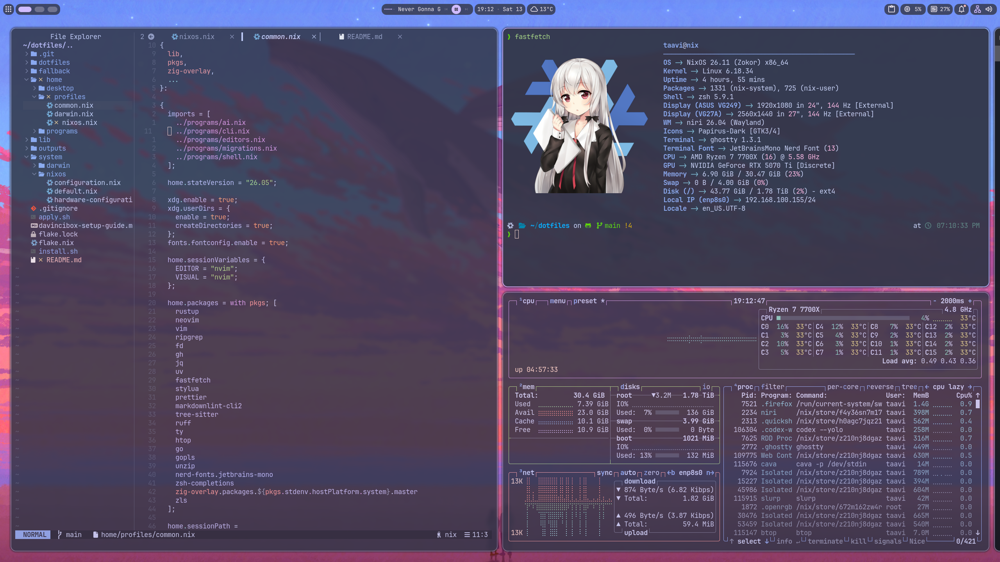

# dotfiles

Personal dotfiles for Linux (NixOS) and macOS.



## Apply This Repo

Nix must already be installed before running the wrapper.

```sh
git clone https://github.com/tea-ok/dotfiles.git ~/dotfiles
cd ~/dotfiles
./install.sh
```

The wrapper auto-detects the current OS:

- macOS creates `/etc/nix-darwin/flake.nix`, then runs `darwin-rebuild switch --flake .#mac`
- NixOS runs `sudo nixos-rebuild switch --flake .#nix`

To preview or build manually:

```sh
nix build .#darwinConfigurations.mac.system --no-link
nix build .#nixosConfigurations.nix.config.system.build.toplevel --no-link
```

## Updating Apps

Most apps are pinned by `flake.lock`. To update Nix-packaged apps, including
`codex` and `claude-code`, bump `nixpkgs`:

```sh
nix flake update nixpkgs
```

For macOS Homebrew-managed apps and taps, update the Homebrew inputs:

```sh
nix flake update homebrew-core homebrew-cask
```

Then preview or apply the config with the commands above. Commit the resulting
`flake.lock` change after checking that the updated configuration evaluates.

## Flake Outputs

- `darwinConfigurations.mac`: nix-darwin system config for macOS, with Home Manager attached for user config.
- `nixosConfigurations."nix"`: NixOS system config for this machine, with Home Manager attached for user config.
- `templates.devshell`: Cross-platform project dev shell baseline.

The macOS flake symlink should point at the root flake:

```sh
/etc/nix-darwin/flake.nix -> /Users/taavi/dotfiles/flake.nix
```

## Layout

| Path | Purpose |
|---|---|
| `flake.nix` | Root flake inputs and delegation to `outputs/` |
| `outputs/` | Public flake outputs for nix-darwin and Home Manager |
| `templates/` | Reusable flake templates for new projects |
| `lib/` | Shared Nix helpers, host names, usernames, and package setup |
| `system/darwin/` | macOS system-level nix-darwin configuration |
| `home/profiles/` | Small Home Manager entrypoints for common, macOS, and NixOS |
| `home/programs/` | Focused Home Manager modules for shell, CLI, editors, and AI tools |
| `home/desktop/` | Platform desktop modules such as Ghostty, Hyprland, and theme config |
| `dotfiles/` | Raw config trees referenced by Home Manager or kept for archival use |
| `fallback/` | Minimal non-Nix fallback kit for zsh, vim, and tmux |

## Project Templates

Start a new project dev shell from this repo:

```sh
nix flake init -t ~/dotfiles#devshell
```

## Non-Nix Fallback

For machines where Nix is not available, use the intentionally small fallback
kit:

```sh
./fallback/install.sh
```

See `fallback/README.md` for details. This fallback is not the full managed
desktop setup; it only covers portable zsh, vim, and tmux essentials.

## Shouts-out

- [waifu pic](https://github.com/gvolpe/nix-config) + repo structure inspo
- [the best wm](https://github.com/hyprwm/Hyprland) <3
- [the gorgeous shell](https://github.com/caelestia-dots/shell)
- [the classic cursor](https://github.com/ful1e5/Bibata_Cursor)
- [soothing pastel theme](https://github.com/catppuccin) 😺
